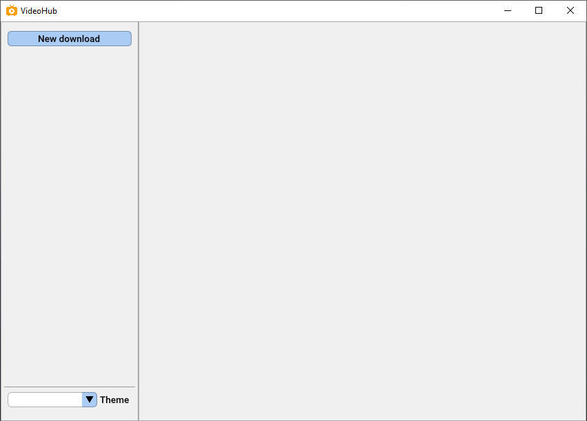
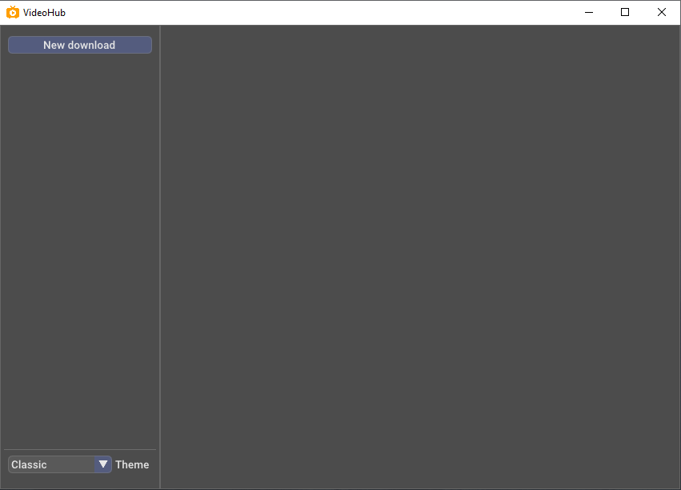
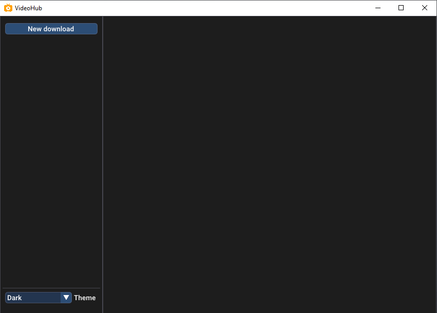
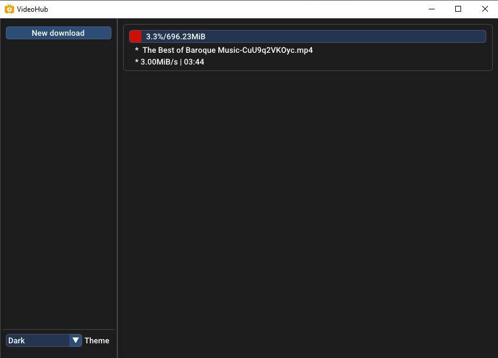
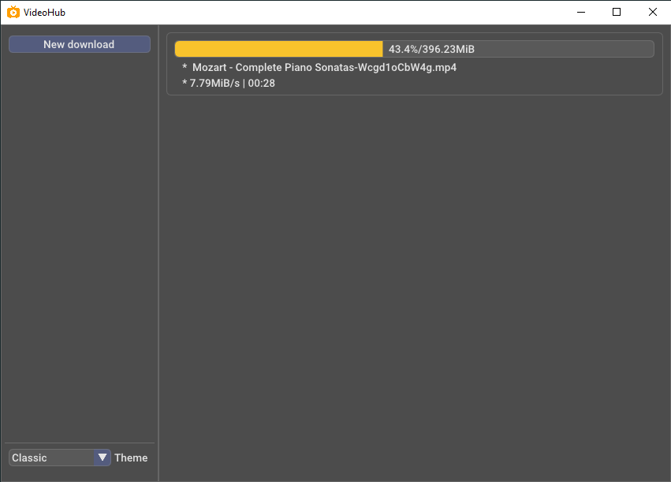
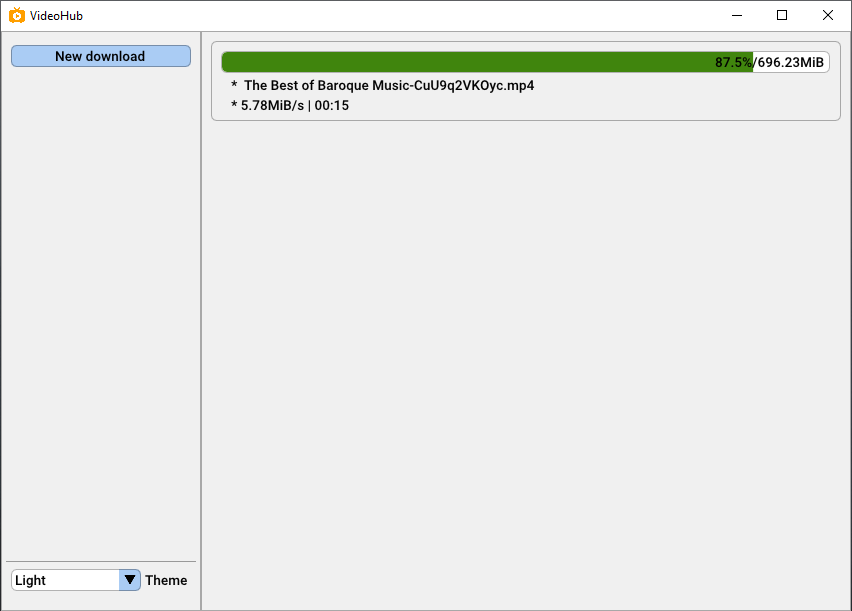

# Video Hub

## :rocket: Download engine

* [youtube-dl](https://github.com/ytdl-org/youtube-dl)
* [aria2](https://github.com/aria2/aria2)

## :hammer: Dependencies

* [nlohmann_json](https://github.com/nlohmann/json)
* [spdlog](https://github.com/gabime/spdlog)
* [glfw](https://github.com/glfw/glfw)
* [glad2](https://github.com/Dav1dde/glad/tree/glad2)
* [doctest](https://github.com/onqtam/doctest)
* [fmtlib](https://github.com/fmtlib/fmt)
* [imgui](https://github.com/ocornut/imgui)

:bulb: Install all dependencies with [vcpkg](https://github.com/microsoft/vcpkg)

```cmd
vcpkg install nlohmann_json spdlog glfw3 doctest fmt
```

:bulb: `glad` and `imgui` are already in [third_party](third_party/)

## :camera: Screen shots







